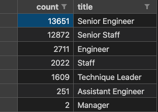

# Pewlett-Hackard-Analysis

*****
*****

* By: Tyler Sojka
* October 2020
* PostgreSQL with pgAdmin (Popsql)

*****
*****

## Overview of the project

Pewlett-Hackard is an enormous company, employing tens of thousands of people. Many of which are starting to get to the age where they will be retiring, putting Pewlett-Hackard in a position where it needs to fill many positions. The purpose of this analysis is to determine how many employees are in a position to retire, and how many employees could be eligible to participate in a mentorship program to help mentor new hires.

We will be gathering the required data by querying a database using SQL. Each of the two questions will be broken down into smaller sub questions as follows:

* Determine how many employees are in a position to retire and their titles
  * Create a Retirement Titles table that holds all the titles of current employees who were born between January 1, 1952 and December 31, 1955.

  * Because some employees may have multiple titles in the database—for example, due to promotions— we need to create a table that contains the most recent title of each employee.

  * Finally, create a final table that has the number of retirement-age employees grouped by most recent job title.

* Determine the employees eligible for the Mentorship Program
  * Create a mentorship-eligibility table that holds the current employees who were born between January 1, 1965 and December 31, 1965.
  
## Results

* The first question asked is how many employees are in a position to retire? To visualize question, it will be broken down into sub-questions.

   1. First We need a table of all the employees born between January 1, 1952 and December 31, 1955:

        

        This block of SQL will return the Employee Number, First Name, Last Name, Title, From Date, and To Date of all the employees who are born between 1952 and 1955. This puts us close to our answer, but not quite because this list includes many duplicate entries for employees who have multiple titles.

   2. Next we need to remove all of the duplicate records and make a table of all unique employees by only including their most recent title:

        

        running this query will result in a table containing unique employee entries and their most recent title:

        

   3. Finally to visualize the amount of each title that will be retiring, we will group the table by titles, and present a total count:

        

        Running this query will result in the following table:

        

* The second task we need to complete compile a list of all the current employees eligible for a mentorship program. This one is a little more straight-forward. All we have to do is adjust or original query birthdate range and add a second filter, to filter out employees no longer employed.

   1. Refactor the original query. We will adjust the birthdate to include employees born in 1965. We then filter those to only include employees still employed by Pewlett-Hackard by filtering the to_date = 9999-01-01. This will result in a table holding information about all of the employees currently employed by Pewlett-Hackard, born in 1965.

        

## Summary

* How many roles will need to be filled as the "silver tsunami" begins to make an impact?
  * If we take a look at the Retirement Title Count table, it clearly shows how many potential employees will be retiring from each position. This means, at some point in the near future, that many roles will need to be filled by new hires:
  
    

    One problem with these numbers, though, is it includes both current and non-current employees. This fact makes for highly inaccurate forecasting. If we modify the table, and query only active employees who have all the same criteria, we get a more accurate measure of the number of employees about to retire:

    

* Are there enough qualified, retirement-ready employees in the departments to mentor the next generation of Pewlett Hackard employees?

  * This answer requires a new query, one to compile the count of all the eligible Mentors into a table grouped by title, to make an easy comparison to those employees who are retiring and will need their spots filled:

    

    Comparing this table to the more accurate retirement table, you can see that in a worst case scenario, where all of the retirement eligible employees quit at the same time, the eligible mentors could take on new hires at around a 3:1, or 4:1 ratio, depending on the title needing filled. This, however, is highly unlikely to occur, and with the given mentors, Pewlett-Hackard should have more than enough mentors to guide any new hires.
  

